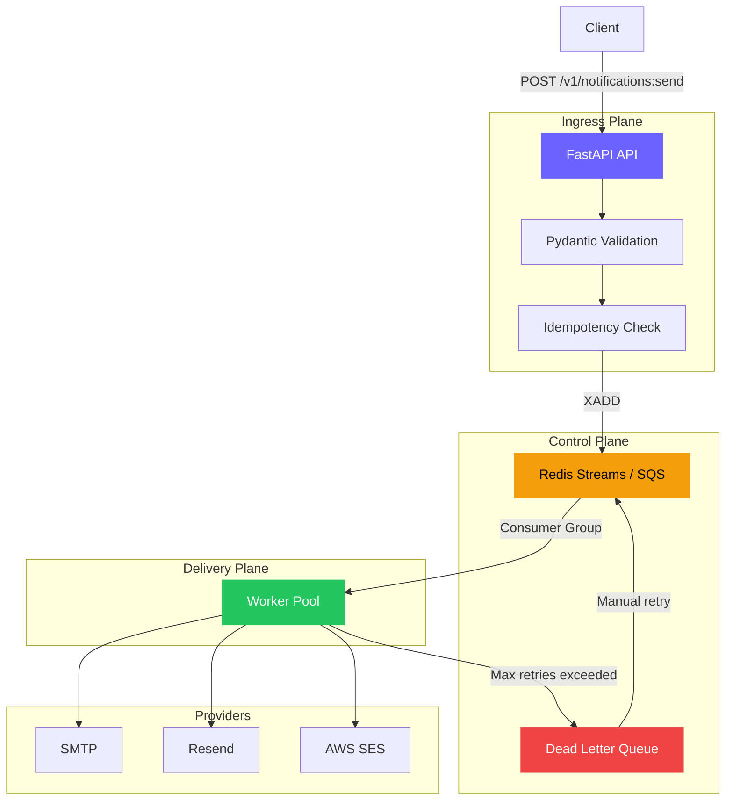

<p align="center">
  <h1 align="center">Notifii</h1>
  <p align="center">
    <strong>Production-grade, cloud-agnostic notification platform</strong><br/>
    Event-driven architecture &middot; Queue-backed durability &middot; Pluggable everything
  </p>
</p>

<p align="center">
  <a href="#-quick-start"></a>
  <a href="#"></a>
  <a href="#"></a>
  <a href="#"></a>
  <a href="#"></a>
</p>

---

## Why Notifii?

It's a **real notification infrastructure** built the way companies like Twilio, Courier, and Novu build theirs:

- **Event-driven** — API returns 202 immediately; delivery is async through a durable queue
- **Queue-backed** — Messages survive crashes. Failed deliveries retry automatically. Poison messages route to a Dead Letter Queue
- **Pluggable backends** — Swap queue (Redis/SQS), email (SMTP/Resend/SES), and storage (Redis/Memory) via environment variables
- **Idempotent** — Duplicate requests return the original response, preventing double-sends
- **Observable** — Structured JSON logs, request ID tracing, Prometheus metrics from day one
- **Cloud-agnostic** — Same code runs locally with Docker Compose or on AWS with Terraform

```
Client  ──▶  FastAPI API  ──▶  Redis Streams  ──▶  Worker  ──▶  Email Provider
               │                     │                │
          Validation            Consumer Group    Retry + DLQ
          Idempotency           Durability        Structured Logs
          Rate Limiting         Ordering          Metrics
```

---

## Quick Start

**Everything runs locally with one command. No AWS. No API keys. No configuration.**

```bash
git clone https://github.com/your-user/notifii.git
cd notifii
make run-demo
```

This starts the entire stack, seeds demo data, and opens the dashboard automatically. **Under 30 seconds.**

Or start manually:

```bash
cp .env.example .env
docker-compose up --build
```

Then send your first notification:

```bash
curl -X POST http://localhost:8000/v1/notifications:send \
  -H "Content-Type: application/json" \
  -d '{
    "channel": "email",
    "recipient": "demo@example.com",
    "message": "Hello from Notifii!",
    "idempotency_key": "my-first-notification"
  }'
```

**Response (202 Accepted):**
```json
{
  "message_id": "a1b2c3d4-e5f6-...",
  "status": "queued"
}
```

| Service | URL | Purpose |
|---|---|---|
| API | http://localhost:8000 | Notification ingress |
| Dashboard | http://localhost:5173 | Admin UI with charts |
| Mailhog | http://localhost:8025 | Email inbox viewer |
| Jaeger | http://localhost:16686 | Distributed traces (with `make up-jaeger`) |
| Metrics | http://localhost:8000/metrics | Prometheus-compatible |
| API Docs | http://localhost:8000/docs | Interactive Swagger UI |

### Interactive Demo

```bash
# Run the guided demo (sends notifications, simulates failures, retries from DLQ)
./scripts/demo.sh

# Or use the dashboard playground
cd dashboard && npm install && npm run dev
# Open http://localhost:5173 → Playground tab
```

---

## Architecture



> Full architecture diagrams with sequence flows, scaling strategies, and component breakdowns: [`docs/architecture.md`](docs/architecture.md)

### Two Deployment Modes — Same Code

| Feature | Local / Free Tier ($0) | AWS Production |
|---|---|---|
| Queue | Redis Streams (Docker/Upstash) | SQS + DLQ |
| Email | SMTP (Mailhog) / Resend / Console | SES |
| Idempotency | Redis / In-Memory | Redis / DynamoDB |
| Compute | Docker Compose | ECS Fargate + ALB |
| Infra-as-Code | docker-compose.yml | Terraform modules |

---

## System Design Highlights

### 1. Adapter Pattern for Portability
Every external dependency sits behind an abstract interface. Swap backends with a single environment variable:

```
QUEUE_BACKEND=redis → RedisQueueAdapter (Redis Streams + consumer groups)
QUEUE_BACKEND=sqs   → SQSAdapter (AWS SQS with DLQ)

EMAIL_PROVIDER=console → Logs to stdout
EMAIL_PROVIDER=smtp    → Any SMTP relay (Mailhog, Gmail, SendGrid)
EMAIL_PROVIDER=resend  → Resend API (free tier)
EMAIL_PROVIDER=ses     → AWS SES
```

### 2. Idempotency at Ingress
Clients send an `idempotency_key` with their request. The API checks Redis (or memory) before enqueuing. Duplicate requests return the original `message_id` instantly — no re-queuing, no double-sends.

### 3. Dead Letter Queue with Retry
Messages that fail delivery after max retries are routed to a DLQ. The dashboard shows DLQ contents with a one-click retry button. This is the same pattern used by AWS SQS, RabbitMQ, and Kafka.

### 4. Consumer Group Processing
Redis Streams consumer groups ensure each message is processed by exactly one worker, even with multiple workers running. Pending entries are tracked and reclaimed if a worker dies mid-processing.

### 5. Distributed Tracing (OpenTelemetry)
End-to-end traces follow a notification from API ingress through queue processing to email delivery — across service boundaries. W3C trace context is propagated through queue message metadata.

```bash
# Start with Jaeger for local tracing
make up-jaeger
# Jaeger UI: http://localhost:16686 — see traces across API and Worker
```

> Full tracing architecture, span hierarchy, and backend options: [`docs/observability.md`](docs/observability.md)

### 6. Failure Simulation 
Toggle simulated failures via API:
```bash
# Enable: all new notifications will fail delivery
curl -X POST localhost:8000/internal/simulate/provider-failure?enable=true

# Send a notification → watch it go to DLQ
# Disable failure → retry from DLQ → successful delivery
```

---

## API Reference

### Core
| Method | Endpoint | Description |
|---|---|---|
| `POST` | `/v1/notifications:send` | Send a notification (202 Accepted) |
| `GET` | `/v1/notifications/recent` | Recent processed notifications |

### Queue Management
| Method | Endpoint | Description |
|---|---|---|
| `GET` | `/v1/queue/depth` | Current queue depth |
| `GET` | `/v1/queue/dlq` | Dead letter queue contents |
| `POST` | `/v1/queue/dlq/{id}/retry` | Retry a DLQ message |

### Demo & Playground
| Method | Endpoint | Description |
|---|---|---|
| `POST` | `/demo/seed` | Seed 5 example notifications |
| `POST` | `/demo/send-test` | Quick send for playground |
| `GET` | `/demo/activity` | Demo activity log |

### Observability
| Method | Endpoint | Description |
|---|---|---|
| `GET` | `/health` | Health check |
| `GET` | `/ready` | Readiness check |
| `GET` | `/metrics` | Prometheus text format |
| `GET` | `/metrics/json` | JSON metrics snapshot |
| `GET` | `/internal/config` | Current configuration |

### Simulation
| Method | Endpoint | Description |
|---|---|---|
| `POST` | `/internal/simulate/provider-failure` | Toggle delivery failures |
| `POST` | `/internal/simulate/slow-delivery` | Toggle 5s delivery delay |

---

## Project Structure

```
notifii/
├── services/
│   ├── shared/                        # Abstraction layers
│   │   ├── queue/                     # QueueAdapter ABC + Redis, SQS, Memory
│   │   ├── email/                     # EmailAdapter ABC + SMTP, Resend, SES, Console
│   │   ├── idempotency/              # IdempotencyStore ABC + Redis, Memory
│   │   └── observability/            # Structured logging, metrics, middleware
│   ├── notification-api/             # FastAPI ingress (API + validation + routing)
│   │   ├── src/main.py
│   │   └── tests/                    # 19+ unit & integration tests
│   └── email-worker/                 # Queue consumer + delivery
│       └── src/worker.py
├── dashboard/                         # React + Vite + Recharts admin UI
├── deploy/                           # Fly.io, Railway, Render configs
├── scripts/                          # Demo script
├── docs/                             # Architecture diagrams (Mermaid)
├── infra/                            # Terraform (AWS production mode)
├── .github/workflows/ci.yml         # CI pipeline (lint → test → build → integration)
├── docker-compose.yml                # Local dev stack
└── docker-compose.test.yml           # Containerized test runner
```

---

## Configuration

All configuration via environment variables (see [`.env.example`](.env.example)):

| Variable | Default | Options |
|---|---|---|
| `QUEUE_BACKEND` | `redis` | `redis`, `sqs`, `memory` |
| `EMAIL_PROVIDER` | `console` | `console`, `smtp`, `resend`, `ses` |
| `IDEMPOTENCY_BACKEND` | `redis` | `redis`, `memory` |
| `REDIS_URL` | `redis://localhost:6379/0` | Any Redis URL |
| `DEMO_MODE` | `false` | `true` enables rate limiting + demo endpoints |
| `APP_ENV` | `dev` | `dev`, `staging`, `prod` |
| `RATE_LIMIT_PER_MIN` | `60` | Rate limit for demo mode |
| `OTEL_ENABLED` | `false` | Enable OpenTelemetry tracing |
| `OTEL_EXPORTER_OTLP_ENDPOINT` | `http://localhost:4317` | OTLP gRPC collector |

---

## Deployment

### Free Tier (Total: $0/month)

| Component | Option 1 | Option 2 | Option 3 |
|---|---|---|---|
| API | Fly.io (3 free VMs) | Render (750 hrs/mo) | Koyeb (1 nano free) |
| Worker | Fly.io | Render | Koyeb |
| Redis | Upstash (10K cmds/day) | Render Redis | — |
| Email | Resend (3K/mo) | Console | SMTP |
| Dashboard | Vercel | Netlify | Cloudflare Pages |

Deployment configs in [`deploy/`](deploy/):

```bash
# Fly.io (recommended)
fly deploy --config deploy/fly/fly.api.toml

# Render (auto-provisions from render.yaml)
# Push to GitHub → Render dashboard → New Blueprint

# Koyeb
koyeb service create notifii-api --docker ghcr.io/your-user/notifii-api:latest
```

See [`deploy/README.md`](deploy/README.md) for full instructions.

---

## How This Scales to Millions of Notifications

The architecture is designed to scale horizontally at every layer:

| Layer | Strategy | Scaling Mechanism |
|---|---|---|
| **API** | Stateless pods behind load balancer | Auto-scale on CPU / request rate |
| **Queue** | Redis Cluster or SQS | Partitioning, unlimited SQS throughput |
| **Workers** | Consumer group members | Add pods — each gets unique messages |
| **Idempotency** | Redis Cluster with TTL | Key sharding across nodes |
| **Email** | Multiple providers | Round-robin, failover, rate-limit aware |

### Throughput Estimates

| Setup | Throughput | Enqueue Latency (p99) |
|---|---|---|
| Single Docker Compose | ~100/sec | <50ms |
| 3 API + 5 Workers | ~2,000/sec | <20ms |
| 10 API + 20 Workers + Redis Cluster | ~50,000/sec | <10ms |
| SQS + ECS Auto-scaling | ~500,000+/sec | <15ms |

### What makes this production-ready:

- **No message loss** — Queue persists messages; workers ACK only after successful delivery
- **Exactly-once semantics** — Idempotency key prevents duplicate processing
- **Graceful degradation** — Workers handle SIGTERM, drain in-flight messages before shutdown
- **Backpressure** — Rate limiting at ingress prevents queue overload
- **Dead letter isolation** — Failed messages don't block the pipeline

---

## Testing

```bash
# Unit + integration (no Docker needed, uses memory backends)
make test

# Docker-based integration test
make test-docker

# Full CI pipeline (runs in GitHub Actions)
# lint → test → docker build → integration smoke test
```

**19+ tests** covering:
- Health and readiness endpoints
- Notification send (202 + idempotency)
- Validation (6 edge cases: missing fields, empty values, invalid channels)
- Request ID propagation
- Failure simulation toggles
- Queue depth and DLQ inspection
- Metrics endpoint

---

## Development

```bash
# Full stack with Docker
make up          # Start all services
make logs        # Follow logs
make demo        # Quick curl demo
make down        # Stop and clean up

# Local development
make test        # Run tests
make lint        # Check code style
make format      # Auto-format code

# Dashboard
cd dashboard && npm install && npm run dev
```

---

## Architecture Decisions

| Decision | Rationale |
|---|---|
| **Event-driven (async)** | Decouples ingress latency from delivery latency. API stays fast regardless of email provider speed. |
| **Queue as durability layer** | Messages survive API restarts. Retry is automatic. Failed messages are isolated in DLQ. |
| **Adapter pattern** | Every external dependency behind an ABC. Swap providers without changing business logic. |
| **Contract-first API** | OpenAPI spec is the source of truth. Pydantic enforces the contract at runtime. |
| **Structured observability** | JSON logs + request ID + Prometheus metrics from day one. Not bolted on later. |
| **Consumer groups** | Multiple workers process messages in parallel without duplication. Built-in load balancing. |

---

## Contributing

See [CONTRIBUTING.md](CONTRIBUTING.md) for development setup, code style, and PR process.

## Security

See [SECURITY.md](SECURITY.md) for security practices and vulnerability reporting.

## License

MIT
