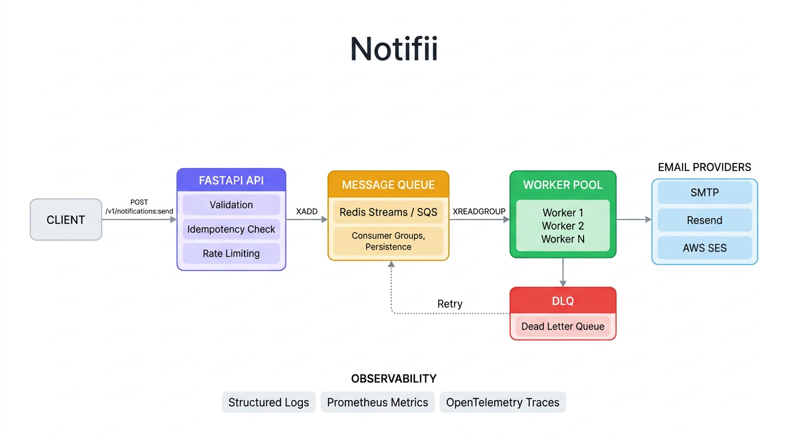

<p align="center">
  <h1 align="center">Notifii</h1>
  <p align="center">
    <strong>Production-grade notification platform with event-driven architecture</strong><br/>
    Queue-backed durability &middot; Pluggable providers &middot; Distributed tracing &middot; Zero config demo
  </p>
</p>

<p align="center">
  <a href="#quick-start"></a>
  <a href="https://github.com/prakhyatc/notifii/actions/workflows/ci.yml"></a>
  <a href="#"></a>
  <a href="#"></a>
</p>

---

## Demo

<!-- Replace with your recorded GIF: see docs/demo-recording.md for instructions -->


> **Clone and run in 30 seconds.** No cloud accounts. No API keys. No configuration.

```bash
git clone https://github.com/prakhyatc/notifii.git
cd notifii
make run-demo
```

*Send notification → queue → deliver → simulate failure → DLQ → retry → success. All visible in the dashboard.*

> [Recording a demo GIF?](docs/demo-recording.md) — replace the diagram above with `docs/demo.gif` once recorded.

---

## What Is This?

Notifii is a **notification delivery platform** built the way companies like Twilio, Courier, and Novu build theirs. The API accepts notification requests and returns 202 immediately. Messages flow through a durable queue (Redis Streams or SQS), are processed by a pool of workers, and delivered via pluggable email providers. Failed deliveries retry automatically; permanently failed messages route to a Dead Letter Queue for manual inspection.

Everything — queue backend, email provider, idempotency store — is swappable via environment variables. The same code runs locally with Docker Compose or on AWS with Terraform.

---

## Engineering Highlights

### Event-Driven Architecture
The API never delivers emails synchronously. Every notification is enqueued and returned as 202 Accepted in <50ms. Workers drain the queue independently, isolating API latency from provider latency. During provider outages, the queue absorbs all traffic with zero message loss.

### Queue Abstraction Layer
All queue operations go through a `QueueAdapter` abstract base class. Swap backends with one environment variable:
- `QUEUE_BACKEND=redis` — Redis Streams with consumer groups, persistence, and ordering
- `QUEUE_BACKEND=sqs` — AWS SQS with managed DLQ
- `QUEUE_BACKEND=memory` — In-memory for testing (zero infrastructure)

### Idempotency at Ingress
Clients send an `idempotency_key` with their request. The API checks Redis atomically (`SET NX` with 24h TTL) before enqueuing. Duplicate requests return the original `message_id` — no re-queuing, no double-sends. This is the same pattern Stripe uses for payment idempotency.

### Dead Letter Queue with Manual Retry
Messages that fail delivery after max retries move to a DLQ (separate Redis Stream). The dashboard shows DLQ contents and supports one-click retry. Retried messages re-enter the main stream and follow the normal processing pipeline.

### Retry Strategy
Workers use the Redis consumer group's pending entry list (PEL) for retries. Unacknowledged messages are automatically reclaimed on the next poll cycle. After exhausting retries, messages are moved to the DLQ rather than being dropped.

### Observability Stack
Three pillars from day one — not bolted on later:
- **Structured JSON logs** with automatic `trace_id` correlation
- **Prometheus-compatible metrics** — counters for received/queued/delivered/failed, gauge for queue depth
- **OpenTelemetry distributed tracing** — spans propagated from API through queue messages to worker delivery via W3C trace context

```bash
make up-jaeger    # Start with Jaeger → see traces at http://localhost:16686
```

---

## Quick Start

```bash
git clone https://github.com/prakhyatc/notifii.git
cd notifii
make run-demo
```

This starts the entire stack, seeds demo data, and opens the dashboard automatically. **Under 30 seconds.**

Or start manually:

```bash
cp .env.example .env
docker-compose up --build
```

Then send your first notification:

```bash
curl -X POST http://localhost:8000/v1/notifications:send \
  -H "Content-Type: application/json" \
  -d '{
    "channel": "email",
    "recipient": "demo@example.com",
    "message": "Hello from Notifii!",
    "idempotency_key": "my-first-notification"
  }'
```

**Response (202 Accepted):**
```json
{
  "message_id": "a1b2c3d4-e5f6-...",
  "status": "queued"
}
```

| Service | URL | Purpose |
|---|---|---|
| API | http://localhost:8000 | Notification ingress |
| Dashboard | http://localhost:5173 | Admin UI with charts |
| Mailhog | http://localhost:8025 | Email inbox viewer |
| Jaeger | http://localhost:16686 | Distributed traces (with `make up-jaeger`) |
| Metrics | http://localhost:8000/metrics | Prometheus-compatible |
| API Docs | http://localhost:8000/docs | Interactive Swagger UI |

### Interactive Demo

```bash
# Run the guided demo (sends notifications, simulates failures, retries from DLQ)
./scripts/demo.sh

# Or use the dashboard playground
cd dashboard && npm install && npm run dev
# Open http://localhost:5173 → Playground tab
```

---

## Architecture


```
Client ──▶ FastAPI API ──▶ Redis Streams ──▶ Worker Pool ──▶ Email Provider
              │                  │                │
         Validation        Consumer Group     Retry + DLQ
         Idempotency       Persistence        Structured Logs
         Rate Limiting     Ordering           Metrics + Traces
```

> Full Mermaid diagrams with sequence flows, scaling strategies, and component breakdowns: [`docs/architecture.md`](docs/architecture.md)

### Two Deployment Modes — Same Code

| Feature | Local / Free Tier ($0) | AWS Production |
|---|---|---|
| Queue | Redis Streams (Docker/Upstash) | SQS + DLQ |
| Email | SMTP (Mailhog) / Resend / Console | SES |
| Idempotency | Redis / In-Memory | Redis / DynamoDB |
| Compute | Docker Compose | ECS Fargate + ALB |
| Infra-as-Code | docker-compose.yml | Terraform modules |

---

## Documentation

| Document | Description |
|---|---|
| [`docs/system-design.md`](docs/system-design.md) | Full system design case study — problem statement, requirements, architecture decisions, tradeoffs, scaling |
| [`docs/architecture.md`](docs/architecture.md) | Mermaid diagrams — system overview, request lifecycle, component architecture, deployment modes, scaling |
| [`docs/performance.md`](docs/performance.md) | Load testing with k6 — benchmark tables, queue buffering analysis, horizontal scaling recipes |
| [`docs/observability.md`](docs/observability.md) | OpenTelemetry tracing, structured logging, Prometheus metrics — setup and architecture |
| [`docs/interview-notes.md`](docs/interview-notes.md) | Interview talking points — design decisions, tradeoffs, scaling approach, improvement ideas |
| [`docs/demo-recording.md`](docs/demo-recording.md) | How to record a demo GIF for the README |

---

## API Reference

### Core
| Method | Endpoint | Description |
|---|---|---|
| `POST` | `/v1/notifications:send` | Send a notification (202 Accepted) |
| `GET` | `/v1/notifications/recent` | Recent processed notifications |

### Queue Management
| Method | Endpoint | Description |
|---|---|---|
| `GET` | `/v1/queue/depth` | Current queue depth |
| `GET` | `/v1/queue/dlq` | Dead letter queue contents |
| `POST` | `/v1/queue/dlq/{id}/retry` | Retry a DLQ message |

### Demo & Playground
| Method | Endpoint | Description |
|---|---|---|
| `POST` | `/demo/seed` | Seed 5 example notifications |
| `POST` | `/demo/send-test` | Quick send for playground |
| `GET` | `/demo/activity` | Demo activity log |

### Observability
| Method | Endpoint | Description |
|---|---|---|
| `GET` | `/health` | Health check |
| `GET` | `/ready` | Readiness check |
| `GET` | `/metrics` | Prometheus text format |
| `GET` | `/metrics/json` | JSON metrics snapshot |
| `GET` | `/internal/config` | Current configuration |

### Simulation
| Method | Endpoint | Description |
|---|---|---|
| `POST` | `/internal/simulate/provider-failure` | Toggle delivery failures |
| `POST` | `/internal/simulate/slow-delivery` | Toggle 5s delivery delay |

---

## Project Structure

```
notifii/
├── services/
│   ├── shared/                        # Abstraction layers (the core of the project)
│   │   ├── queue/                     # QueueAdapter ABC + Redis, SQS, Memory
│   │   ├── email/                     # EmailAdapter ABC + SMTP, Resend, SES, Console
│   │   ├── idempotency/              # IdempotencyStore ABC + Redis, Memory
│   │   └── observability/            # Logging, metrics, middleware, OpenTelemetry
│   ├── notification-api/             # FastAPI ingress (API + validation + routing)
│   │   ├── src/main.py
│   │   └── tests/                    # 19+ unit & integration tests
│   └── email-worker/                 # Queue consumer + email delivery
│       └── src/worker.py
├── dashboard/                         # React + Vite + Recharts admin UI
├── docs/                             # System design, architecture, performance, observability
│   ├── system-design.md              # Full case study for interviews
│   ├── architecture.md               # Mermaid diagrams
│   ├── performance.md                # Benchmarks + k6 load testing
│   ├── observability.md              # Tracing, logging, metrics
│   └── interview-notes.md           # Talking points for interviews
├── deploy/                           # Fly.io, Render, Koyeb configs
├── load-tests/k6/                    # k6 load test scripts
├── scripts/                          # Demo and helper scripts
├── infra/                            # Terraform (AWS production mode)
├── .github/workflows/ci.yml         # CI pipeline (lint → test → build → integration)
├── docker-compose.yml                # Local dev stack
└── docker-compose-jaeger.yml         # Stack with distributed tracing
```

---

## Configuration

All configuration via environment variables (see [`.env.example`](.env.example)):

| Variable | Default | Options |
|---|---|---|
| `QUEUE_BACKEND` | `redis` | `redis`, `sqs`, `memory` |
| `EMAIL_PROVIDER` | `console` | `console`, `smtp`, `resend`, `ses` |
| `IDEMPOTENCY_BACKEND` | `redis` | `redis`, `memory` |
| `REDIS_URL` | `redis://localhost:6379/0` | Any Redis URL |
| `DEMO_MODE` | `false` | `true` enables rate limiting + demo endpoints |
| `APP_ENV` | `dev` | `dev`, `staging`, `prod` |
| `RATE_LIMIT_PER_MIN` | `60` | Rate limit for demo mode |
| `OTEL_ENABLED` | `false` | Enable OpenTelemetry tracing |
| `OTEL_EXPORTER_OTLP_ENDPOINT` | `http://localhost:4317` | OTLP gRPC collector |

---

## Deployment

### Recommended: Run Locally (Cost: $0)

The project is designed to run entirely on your machine with Docker Compose — no cloud accounts, no API keys, no costs.

```bash
make run-demo     # Full stack in 30 seconds
make up           # Manual start
make up-jaeger    # With distributed tracing (Jaeger UI at :16686)
```

### Cloud Deployment Options

Deployment configs are in [`deploy/`](deploy/) for Fly.io, Render, and Koyeb. All require Docker container hosting.

| Component | Fly.io | Render | Koyeb |
|---|---|---|---|
| API | `fly deploy` | Blueprint | `koyeb service create` |
| Worker | `fly deploy` | Blueprint | `koyeb service create` |
| Redis | Upstash (free 10K cmds/day) | Managed ($7+/mo) | Upstash |
| Email | Resend (free 3K/mo) | Resend | Resend |
| Dashboard | Vercel (free) | Vercel (free) | Vercel (free) |

> **Note:** Most Docker-hosting platforms (Render, Railway) no longer offer free compute tiers. Fly.io offers 3 free shared VMs but requires a credit card. For a zero-cost demo, use `make run-demo` locally.

See [`deploy/README.md`](deploy/README.md) for full step-by-step instructions.

---

## How This Scales to Millions of Notifications

The architecture is designed to scale horizontally at every layer:

| Layer | Strategy | Scaling Mechanism |
|---|---|---|
| **API** | Stateless pods behind load balancer | Auto-scale on CPU / request rate |
| **Queue** | Redis Cluster or SQS | Partitioning, unlimited SQS throughput |
| **Workers** | Consumer group members | Add pods — each gets unique messages |
| **Idempotency** | Redis Cluster with TTL | Key sharding across nodes |
| **Email** | Multiple providers | Round-robin, failover, rate-limit aware |

### Throughput Estimates

| Setup | Throughput | Enqueue Latency (p99) |
|---|---|---|
| Single Docker Compose | ~100/sec | <50ms |
| 3 API + 5 Workers | ~2,000/sec | <20ms |
| 10 API + 20 Workers + Redis Cluster | ~50,000/sec | <10ms |
| SQS + ECS Auto-scaling | ~500,000+/sec | <15ms |

### What makes this production-ready:

- **No message loss** — Queue persists messages; workers ACK only after successful delivery
- **Exactly-once semantics** — Idempotency key prevents duplicate processing
- **Graceful degradation** — Workers handle SIGTERM, drain in-flight messages before shutdown
- **Backpressure** — Rate limiting at ingress prevents queue overload
- **Dead letter isolation** — Failed messages don't block the pipeline

---

## Testing

```bash
# Unit + integration (no Docker needed, uses memory backends)
make test

# Docker-based integration test
make test-docker

# Full CI pipeline (runs in GitHub Actions)
# lint → test → docker build → integration smoke test
```

**19+ tests** covering:
- Health and readiness endpoints
- Notification send (202 + idempotency)
- Validation (6 edge cases: missing fields, empty values, invalid channels)
- Request ID propagation
- Failure simulation toggles
- Queue depth and DLQ inspection
- Metrics endpoint

---

## Development

```bash
# Full stack with Docker
make up          # Start all services
make logs        # Follow logs
make demo        # Quick curl demo
make down        # Stop and clean up

# Local development
make test        # Run tests
make lint        # Check code style
make format      # Auto-format code

# Dashboard
cd dashboard && npm install && npm run dev
```

---

## Contributing

See [CONTRIBUTING.md](CONTRIBUTING.md) for development setup, code style, and PR process.

## Security

See [SECURITY.md](SECURITY.md) for security practices and vulnerability reporting.

## License

MIT
