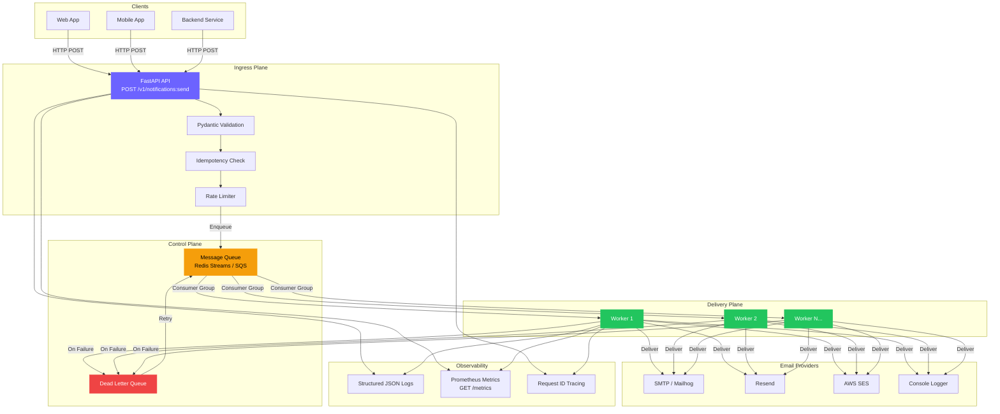
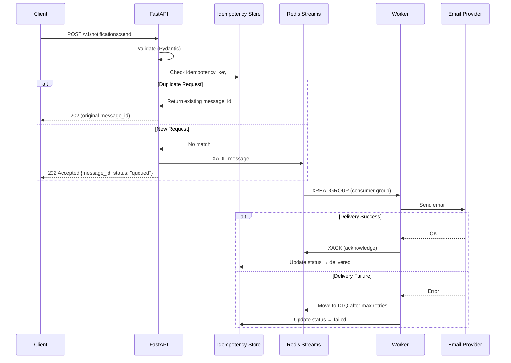
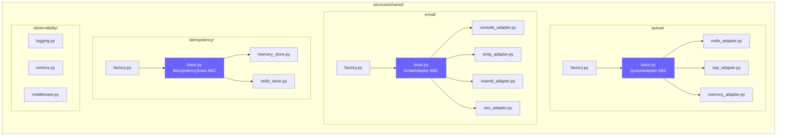
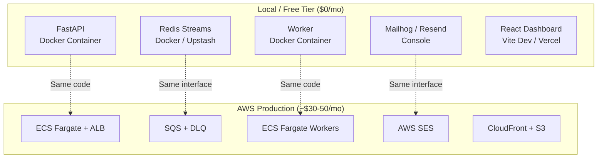
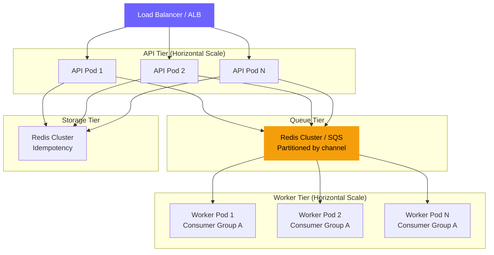

# Notifii Architecture

## System Overview

## Request Lifecycle

## Component Architecture

## Deployment Modes

## Scaling to Millions

### Scaling Strategy

| Component | Strategy | Bottleneck | Solution |
|---|---|---|---|
| API | Horizontal pods behind LB | CPU/memory | Auto-scale on request rate |
| Queue | Redis Cluster / SQS | Throughput | Partition by channel, increase shards |
| Workers | Consumer groups | Processing rate | Add more consumers to the group |
| Idempotency | Redis Cluster | Memory | TTL expiry, key sharding |
| Email | Provider rate limits | API quotas | Multiple providers, round-robin |

### Throughput Estimates

| Setup | Notifications/sec | Latency (p99) |
|---|---|---|
| Single Docker Compose | ~100 | <50ms enqueue |
| 3 API + 5 Workers | ~2,000 | <20ms enqueue |
| 10 API + 20 Workers + Redis Cluster | ~50,000 | <10ms enqueue |
| SQS + ECS Auto-scaling | ~500,000+ | <15ms enqueue |
