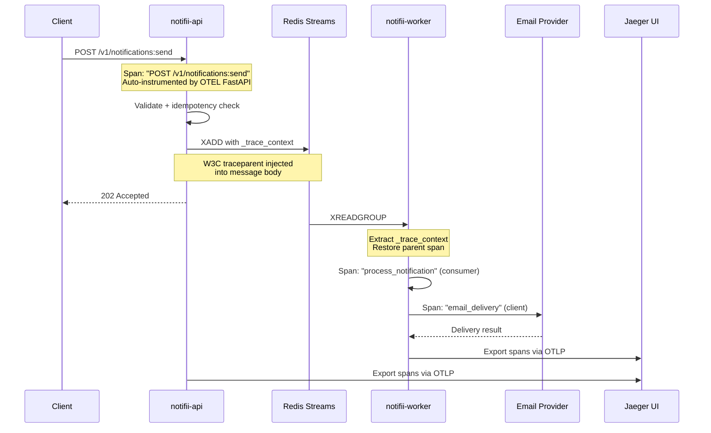
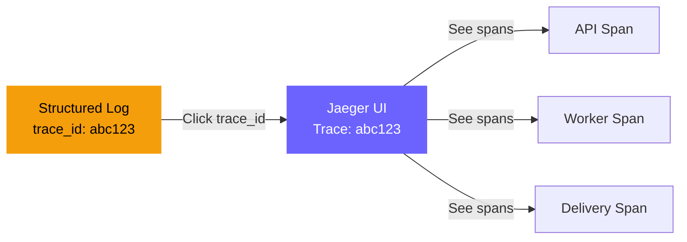

# Observability Guide

Notifii has three observability pillars: **structured logging**, **Prometheus metrics**, and **distributed tracing** (OpenTelemetry).

---

## Distributed Tracing (OpenTelemetry)

### Overview

Traces follow a notification from the moment a client sends a request all the way through queue processing and email delivery — across service boundaries.



### Trace Context Propagation

The key challenge in event-driven architectures is maintaining trace continuity across async boundaries. Notifii solves this by embedding W3C trace context directly in queue messages:

```mermaid
graph LR
    subgraph "API (Producer)"
        A1[Incoming Request<br/>traceparent header] --> A2[FastAPI Span]
        A2 --> A3[inject_trace_context]
        A3 --> A4["Queue Message<br/>{..., _trace_context: {traceparent: '00-abc...'}}"]
    end

    subgraph "Queue"
        A4 --> Q[Redis Streams<br/>Message persisted with trace context]
    end

    subgraph "Worker (Consumer)"
        Q --> W1[extract_trace_context]
        W1 --> W2[Restored Parent Context]
        W2 --> W3["Span: process_notification<br/>(child of API span)"]
        W3 --> W4["Span: email_delivery<br/>(child of process span)"]
    end

    style A3 fill:#6c63ff,stroke:#6c63ff,color:#fff
    style W1 fill:#6c63ff,stroke:#6c63ff,color:#fff
```



### Span Hierarchy

A single notification produces this span tree:

```
[notifii-api] POST /v1/notifications:send          ← auto-instrumented (server)
  └── [notifii-worker] process_notification         ← manual span (consumer)
       ├── attributes: message_id, channel, recipient
       └── [notifii-worker] email_delivery           ← manual span (client)
            ├── attributes: email.to, email.provider, email.success
            └── attributes: email.provider_message_id
```

### Quick Start with Jaeger

```bash
# Start the full stack with tracing enabled
docker compose -f docker-compose-jaeger.yml up --build

# Services:
#   API:        http://localhost:8000
#   Jaeger UI:  http://localhost:16686
#   Mailhog:    http://localhost:8025

# Send a notification
curl -X POST http://localhost:8000/v1/notifications:send \
  -H "Content-Type: application/json" \
  -d '{"channel":"email","recipient":"trace-test@example.com","message":"Testing distributed tracing!"}'

# Open Jaeger UI → search for service "notifii-api" → click the trace
# You'll see spans across API and Worker with full context propagation
```

### Configuration

| Variable | Default | Description |
|---|---|---|
| `OTEL_ENABLED` | `false` | Set to `true` to enable tracing |
| `OTEL_EXPORTER_OTLP_ENDPOINT` | `http://localhost:4317` | OTLP gRPC collector endpoint |
| `OTEL_SERVICE_NAME` | (set per service) | Service name in traces |

When `OTEL_ENABLED=false` (the default), all tracing code is a safe no-op with zero overhead.

### Using with Other Backends

The OTLP exporter works with any OpenTelemetry-compatible backend:

| Backend | OTLP Endpoint | Notes |
|---|---|---|
| Jaeger | `http://jaeger:4317` | Local dev (included in docker-compose-jaeger.yml) |
| Grafana Tempo | `http://tempo:4317` | Pairs with Grafana for dashboards |
| Honeycomb | `https://api.honeycomb.io:443` | Set `OTEL_EXPORTER_OTLP_HEADERS` with API key |
| Datadog | `http://datadog-agent:4317` | Via Datadog Agent OTLP ingestion |
| AWS X-Ray | Via ADOT collector | Use AWS Distro for OpenTelemetry |

---

## Structured Logging

Every log line is a JSON object with consistent fields:

```json
{
  "timestamp": "2026-03-11T10:30:00.123456+00:00",
  "level": "INFO",
  "service": "notification-api",
  "env": "dev",
  "event": "notification_queued",
  "trace_id": "abc123def456...",
  "message_id": "a1b2c3d4-...",
  "channel": "email"
}
```

When tracing is enabled, `trace_id` is automatically included so you can jump from a log line directly to the trace in Jaeger.

### Log-Trace Correlation



---

## Prometheus Metrics

Available at `GET /metrics` (Prometheus text format) and `GET /metrics/json`.

### Counters

| Metric | Description |
|---|---|
| `notifications_received_total` | Requests received by API |
| `notifications_queued_total` | Successfully enqueued |
| `notifications_processed_total` | Processed by workers |
| `delivery_success_total` | Successful deliveries |
| `delivery_failures_total` | Failed deliveries |
| `idempotency_duplicates_total` | Duplicate requests blocked |
| `http_requests_total` | Total HTTP requests |
| `http_errors_total` | HTTP 4xx/5xx responses |

### Gauges

| Metric | Description |
|---|---|
| `queue_depth` | Approximate messages in queue |

### Dashboard Integration

The React dashboard at `http://localhost:5173` visualizes these metrics in real-time with:
- Area charts for throughput (delivered vs failed over time)
- Pie chart for delivery breakdown
- Bar chart for queue depth history

---

## Full Observability Stack

```mermaid
graph TB
    subgraph "Application"
        API[notifii-api]
        Worker[notifii-worker]
    end

    subgraph "Observability"
        subgraph "Tracing"
            OTEL[OTLP Exporter]
            JAEGER[Jaeger]
        end
        subgraph "Metrics"
            PROM[/metrics endpoint]
            DASH[Dashboard Charts]
        end
        subgraph "Logging"
            LOG[Structured JSON Logs]
            STDOUT[stdout / Docker logs]
        end
    end

    API -->|spans| OTEL
    Worker -->|spans| OTEL
    OTEL -->|gRPC :4317| JAEGER

    API -->|counters, gauges| PROM
    PROM --> DASH

    API -->|JSON lines| LOG
    Worker -->|JSON lines| LOG
    LOG --> STDOUT

    style JAEGER fill:#6c63ff,stroke:#6c63ff,color:#fff
    style DASH fill:#22c55e,stroke:#22c55e,color:#fff
```

### Accessing Everything

| Tool | URL | What You See |
|---|---|---|
| Jaeger UI | http://localhost:16686 | Distributed traces across services |
| Dashboard | http://localhost:5173 | Metrics charts, queue depth, DLQ |
| Prometheus | http://localhost:8000/metrics | Raw metric values |
| Mailhog | http://localhost:8025 | Captured emails |
| Docker logs | `docker compose logs -f` | Structured JSON logs with trace IDs |
