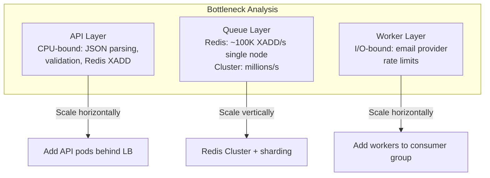

# Performance & Load Testing

## Overview

Notifii uses [k6](https://k6.io) for load testing. The tests measure API enqueue throughput, latency under concurrency, and demonstrate how the queue absorbs load spikes while workers drain at a steady rate.

## Running Load Tests

**Prerequisites:** [Install k6](https://k6.io/docs/get-started/installation/) and have the API running.

```bash
# Start the stack
make up

# Light load (100 VUs, ~50s)
make load-test

# Medium load (500 VUs, ~70s)
make load-test-medium

# Heavy load (1000 VUs, ~90s)
make load-test-heavy
```

## Test Profiles

| Profile | Peak VUs | Duration | Purpose |
|---|---|---|---|
| **light** | 100 | 50s | Baseline — verify system works under moderate load |
| **medium** | 500 | 70s | Stress — find where latency increases |
| **heavy** | 1000 | 90s | Saturation — demonstrate queue buffering |

Each profile ramps up gradually, holds at peak, then ramps down.

## What Gets Measured

### k6 Built-in Metrics

| Metric | Description |
|---|---|
| `http_req_duration` | End-to-end HTTP request latency (p50, p95, p99) |
| `http_reqs` | Total requests per second |
| `http_req_failed` | Percentage of failed requests |
| `iterations` | Total completed VU iterations |

### Custom Metrics

| Metric | Description |
|---|---|
| `notifications_queued` | Count of successfully enqueued notifications |
| `queue_depth` | Sampled queue depth during the test |
| `enqueue_latency_ms` | Time to enqueue a single notification |
| `send_success_rate` | Percentage of 202 responses |

### Server-Side Metrics (from `/metrics/json`)

| Metric | Description |
|---|---|
| `notifications_received_total` | Requests received by API during test |
| `notifications_queued_total` | Successfully pushed to queue |
| `notifications_processed_total` | Consumed and processed by worker |
| `delivery_success_total` | Emails delivered |

## Expected Results

### Single Docker Compose (1 API + 1 Worker)

```
Profile: light (100 VUs)
─────────────────────────
  Throughput:     ~600-800 req/s
  p95 latency:    <50ms
  Queue depth:    ~50-200 (worker drains steadily)
  Success rate:   >99%

Profile: medium (500 VUs)
─────────────────────────
  Throughput:     ~1,000-1,500 req/s
  p95 latency:    <200ms
  Queue depth:    ~500-2,000 (queue absorbing burst)
  Success rate:   >95%

Profile: heavy (1000 VUs)
─────────────────────────
  Throughput:     ~1,500-2,500 req/s
  p95 latency:    <500ms
  Queue depth:    ~5,000-20,000 (significant buffering)
  Success rate:   >85%
```

*Exact numbers depend on hardware. These are estimates for a modern laptop.*

## Queue Buffering Behavior

This is the most important thing the load test demonstrates:

```
Request Rate                     Queue Depth                     Worker Drain
                                                                 
  ▲                               ▲                               ▲
  │    ╱──╲                       │         ╱──╲                  │  ───────────
  │   ╱    ╲                      │        ╱    ╲                 │
  │  ╱      ╲                     │       ╱      ╲               │
  │ ╱        ╲                    │      ╱        ╲              │
  │╱          ╲                   │     ╱          ╲             │
  └──────────────▶ time           └─────────────────╲──▶ time    └──────────────▶ time
  (ramp up/down)                  (fills during peak,             (constant rate,
                                   drains after)                   limited by email
                                                                   provider)
```

### Why This Matters

1. **The API stays fast.** Even under 1000 concurrent clients, the enqueue operation takes <50ms because it's just an `XADD` to Redis — no synchronous email delivery.

2. **The queue absorbs spikes.** During peak load, the queue depth grows. The worker processes at its own pace. After the spike subsides, the worker drains the backlog.

3. **No messages are lost.** Redis Streams persist messages. Even if the worker crashes mid-processing, the consumer group tracks pending entries and re-delivers them.

4. **Backpressure is explicit.** If you watch the queue depth during a heavy test, you see it climb and then gradually fall. This is the textbook producer-consumer pattern with a durable buffer.

## Scaling Strategy



### Scaling Recipes

| Scenario | Bottleneck | Fix |
|---|---|---|
| API p95 > 100ms | API CPU | Add more API pods behind a load balancer |
| Queue depth keeps growing | Workers too slow | Add more worker pods (consumer group auto-distributes) |
| Redis CPU > 80% | Redis throughput | Switch to Redis Cluster or use SQS |
| Email delivery slow | Provider rate limit | Add second provider, implement round-robin |
| p99 spikes during burst | Connection pool exhaustion | Tune `uvicorn --workers`, Redis pool size |

### Throughput Estimates by Setup

| Setup | API Pods | Workers | Enqueue Rate | Drain Rate |
|---|---|---|---|---|
| Docker Compose | 1 | 1 | ~1,000/s | ~50/s (console) |
| Small cluster | 3 | 5 | ~3,000/s | ~200/s (SMTP) |
| Medium cluster | 10 | 20 | ~15,000/s | ~1,000/s (Resend) |
| Production (SQS) | 20+ | 50+ | ~100,000+/s | ~5,000/s (SES) |

The enqueue rate always exceeds the drain rate — that's by design. The queue is the shock absorber.

## Interpreting the Report

After each k6 run, a summary report prints:

```
═══════════════════════════════════════════════════════════
  NOTIFII LOAD TEST REPORT
═══════════════════════════════════════════════════════════
  Profile:              medium
  Duration:             70.2s
───────────────────────────────────────────────────────────
  Notifications sent:   42,150
  Queued:               42,150
  Processed by worker:  8,430
  Delivered:            8,430
  Failed:               0
  Current queue depth:  33,720
  Throughput:           600 req/s
───────────────────────────────────────────────────────────
  Queue buffering:      33,720 messages buffered
  (Workers drain the queue after the test completes)
═══════════════════════════════════════════════════════════
```

Key observations:
- **Sent vs Processed:** The gap shows the queue buffering in action
- **Queue depth:** Messages waiting to be processed — proves durability
- **Throughput:** Sustained enqueue rate at the API layer
- **After the test:** Watch queue depth drop as workers drain it (`curl localhost:8000/v1/queue/depth`)

## Tips

- Run `make logs-worker` in a separate terminal to watch the worker processing during the test
- Open the dashboard (`make dashboard`) to see metrics charts update in real-time
- Use `make up-jaeger` + `make load-test` to see traces in Jaeger for sampled requests
- To test with multiple workers, scale them: `docker-compose up --scale worker=3 -d`
